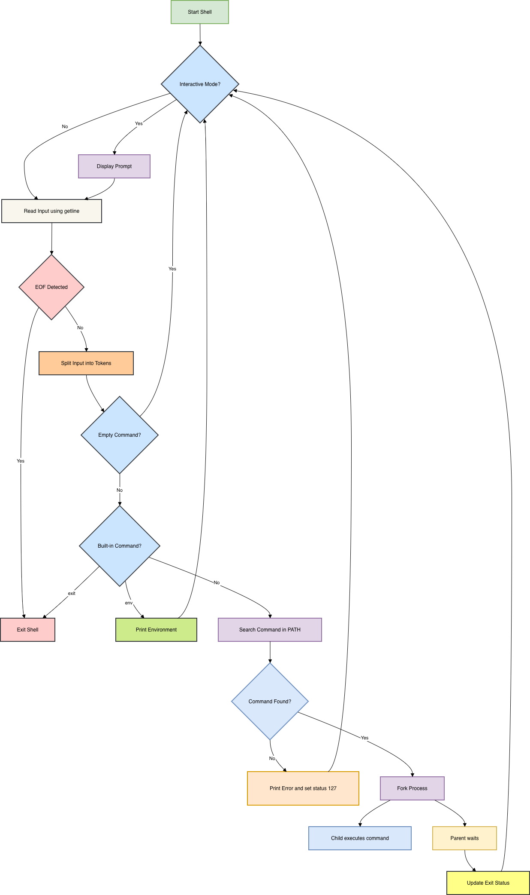

# ✨🐚 Simple Shell 🐚✨

A simple UNIX command line interpreter written in **C**, built from scratch as part of the **Holberton / ALX Software Engineering Program**.

---

## 🌟 Overview

**Simple Shell** is a minimal implementation of a UNIX shell that mimics basic behavior of `/bin/sh`.  
It allows users to execute commands, handle arguments, work with the `PATH` environment variable, and use built-in commands.

The goal of this project is to understand:
- How shells work internally
- Process creation using `fork`
- Program execution using `execve`
- Environment variables
- Memory management in C

---

## ⚙️ Features

- ✅ Interactive and non-interactive modes  
- ✅ Executes commands with arguments  
- ✅ Supports absolute & relative paths  
- ✅ Searches executables using the `PATH` variable  
- ✅ Built-in commands:
- 🛑 `exit` — exit the shell
- 🌍 `env` — print the current environment  
- ✅ Proper error handling (same output as `/bin/sh`)  
- ✅ No memory leaks (checked with **Valgrind**)  
- ✅ Betty style compliant  

---

## ▶️ Usage

### 🔧 Compilation
```bash
gcc -Wall -Werror -Wextra -pedantic -std=gnu89 *.c -o hsh

```

---

## 💻 Interactive Mode
- bash
- Copy code
- ./hsh
- $ ls
- $ pwd
- $ env
- $ exit

---

## 🤖 Non-Interactive Mode
- bash
- Copy code
- echo "ls -l" | ./hsh

---

## 🛠 Built-in Commands
Command	Description
- exit:	Terminates the shell
- env:	Prints all environment variables

---

## 📂 Project Structure

| File | Description |
|------|------------|
| `main.c` | Entry point and main shell loop |
| `shell.h` | Header file (function prototypes and global variables) |
| `input.c` | Reads user input and splits it into commands |
| `execute.c` | Handles PATH searching and command execution |
| `env.c` | Implementation of the `env` built-in command |
| `README.md` | Project documentation |
| `man_1_simple_shell` | Manual page for the simple shell |
| `AUTHORS` | Lists contributors to the project |

---

## 🔍 How It Works:
- 1️⃣ Displays a prompt ($) in interactive mode
- 2️⃣ Reads user input using getline
- 3️⃣ Tokenizes input into arguments
- 4️⃣ Checks for built-in commands (exit, env)
- 5️⃣ Searches executable using PATH
- 6️⃣ Creates a child process using fork
- 7️⃣ Executes command with execve
- 8️⃣ Parent waits for child process to finish

---

## ⚠️ Limitations:
- 🚫 No pipes (|)
- 🚫 No redirections (>, <)
- 🚫 No command separators (;)
- 🚫 No wildcard expansion (*)
- 🚫 No built-in commands like cd

---

## 🧠 Key Concepts Learned:
- ✔️ Process management (fork, wait)
- ✔️ System calls
- ✔️ Environment variables
- ✔️ Error handling
- ✔️ Memory management
- ✔️ UNIX architecture

---

## ~_ Flowchart of `Simple Shell Project`



---

## 👩‍💻 Authors:
- Norah Aljuhani
- Amaal Asiri
